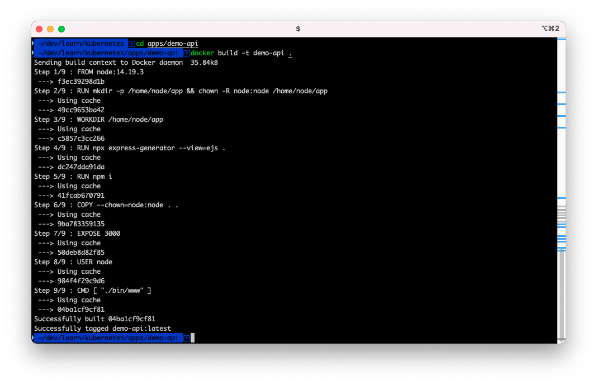

<h1 align="center">
  kubernetes 101 for developers
</h1>

> This is a hands-on tutorial to deploy basic services with kubectl and helm on kubernetes cluster running on local machine.

👉🏼 No cloud account needed.

👉🏼 No Docker desktop needed.

> This tutorial is composed on Intel based Macbook, all the commands and processes should be same for any other machine except tool installation commands.

## Table of contents
---

<!-- toc -->

- [System Setup](#system-setup)
- [kubectl](#kubectl)
  * [Get ready](#get-ready)
  * [Create a Deployment](#create-a-deployment)
  * [Create a Service](#create-a-service)
  * [Clean up](#clean-up)
- [kustomize](#kustomize)
  * [Get ready](#get-ready-1)
  * [Deploy apps](#deploy-apps)
  * [Clean up](#clean-up-1)
- [HELM](#helm)
  * [Get ready](#get-ready-2)
  * [Create a chart with helm CLI](#create-a-chart-with-helm-cli)
  * [Deploy demo-api app with helm](#deploy-demo-api-app-with-helm)
  * [Deploy realblog stack](#deploy-realblog-stack)
  * [Clean up](#clean-up-2)
- [Argo CD](#argo-cd)
- [Get ready](#get-ready-3)
  * [create argocd app](#create-argocd-app)
  * [Clean up](#clean-up-3)

<!-- tocstop -->

## System Setup
---
1.  install [Docker CLI](https://minikube.sigs.k8s.io/docs/tutorials/docker_desktop_replacement/)

	```shell
	brew install docker
	```

2.  install [hyperkit](https://minikube.sigs.k8s.io/docs/drivers/hyperkit/) to be used as docker run time.

	```shell
	brew install hyperkit
	```

3.  install [minikube](brew install minikube
    ) to be used as kubernetes cluster

	```shell
	brew install minikube
	```

4.  configure minikube resources (optional)

	```shell
	minikube config set cpus 6
	minikube config set memory 12g
	```

5.  start minikube

	```shell
	minikube start  --driver=hyperkit --container-runtime=docker
	```

	

6.  verify minikube

	```shell
	minikube kubectl get nodes
	```

	!minkube get pods](./docs/minikube_get_po.png)

7.  point terminal's Docker CLI to the Docker instance inside minikube

	```shell
	eval $(minikube docker-env)
	```

8.  Optionally you can open minikube dashboard

	```shell
	minikube dashboard
	```

	

	It should open a dashboard UI in browser like follow:
	
	

9. Install helm

	```shell
	brew install helm
	```

10. Install Argo CD CLI

	```shell
	brew install argocd
	```

## kubectl
---
### Get ready

1. start minikube

	```shell
	minikube start  --driver=hyperkit --container-runtime=docker
	```

2. point terminal's Docker CLI to the Docker instance inside minikube

	```shell
	eval $(minikube docker-env)
	```

3. build demo app image

	```shell
	cd apps/demo-api
	docker build -t demo-api .
	```
	
	

### Create a Deployment


1. Create demo app Deployment

	Create a Deployment that manages a Pod. The Pod runs a Container based on the provided Docker image.
	We can not set image pull policy on CLI and we want to use the local image, so we will create a simple config file to from CLI itself and add the parameter for image pull policy to "Never".

	**Create a deployment file.**

	```shell
	cd ../ # if not on the root path
	cd kubectl
	```

	```shell
	kubectl create deployment demo-api --image=demo-api:latest --dry-run=client -o yaml > deployment.yaml
	```
	
	
	
	Now Modify `spec.template.spec.containers` in deployment.yaml created.
	
	```shell
	spec:
		containers:
		- image: demo-api:latest
		name: demo-api
		resources: {}
	```
  
	and add `imagePullPolicy: Never` so that it looks like:
    
	```shell
	spec:
		containers:
		- image: demo-api:latest
		name: demo-api
		resources: {}
		imagePullPolicy: Never
	```

	**Apply the config file with kubectl**
	
	```shell
	kubectl apply -f deployment.yaml
	```
	
	Output is similar to:
	
	```shell
	kubectl apply -f deployment.yaml
	deployment.apps/demo-api created
	```


2. View the Deployment:

   ```shell
   kubectl get deployments
   ```

   The output is similar to:

   ```
   NAME       READY   UP-TO-DATE   AVAILABLE   AGE
   demo-api   1/1     1            1           28s
   ```

3. View the Pod:

	```shell
	kubectl get pods
	```

	The output is similar to:

	```shell
	NAME                        READY   STATUS    RESTARTS   AGE
	demo-api-7c7d9f4689-sbkns   1/1     Running   0          100s
	```

4. View cluster events:

	```shell
	kubectl get events
	```

5. View the `kubectl` configuration:

	```shell
	kubectl config view
	```

### Create a Service


By default, the Pod is only accessible by its internal IP address within the
Kubernetes cluster. To make the `demo-api` Container accessible from outside.

1. Expose the Pod to the public internet using the `kubectl expose` command:

	```shell
	kubectl expose deployment demo-api --type=LoadBalancer --port=3000
	```

2. View the Service you created:

	```shell
	kubectl get services
	```

	The output is similar to:

	```shell
	NAME         TYPE           CLUSTER-IP      EXTERNAL-IP   PORT(S)          AGE
	demo-api     LoadBalancer   10.101.236.39   <pending>     3000:30490/TCP   13s
	kubernetes   ClusterIP      10.96.0.1       <none>        443/TCP          21s
	```

3. Run the following command to open the app:

	```shell
	minikube service demo-api
	```

	The output is similar to:

	```shell
	|-----------|----------|-------------|----------------------------|
	| NAMESPACE |   NAME   | TARGET PORT |            URL             |
	|-----------|----------|-------------|----------------------------|
	| default   | demo-api |        3000 | http://192.168.106.3:30490 |
	|-----------|----------|-------------|----------------------------|
	🎉  Opening service default/demo-api in default browser...
	```

	It should open the following page in the browser:

	

### Clean up

1. Now you can clean up the resources you created in your cluster:

	```shell
	kubectl delete service demo-api
	kubectl delete deployment demo-api
	```

2. Optionally, stop the Minikube virtual machine (VM):

	```shell
	minikube stop
	```

3. Optionally, delete the Minikube VM:

	```shell
	minikube delete
	```

## kustomize
---
In this we will deploy multiple services. To do so we will be using multiple config files for kubernetes and will manage the config with help of [kustomize](https://github.com/kubernetes-sigs/kustomize). This will deploy a proper backend, frontend and db instance to power up a full application stack and use it as we do in production. This example will use the realworld blog app API and UI example apps.


We will deploy following services:

1. blog-api: expressjs backend REST API server.
2. blog-ui: react UI app being served by a nginx server.
3. postgres: db for blog-api backend service.

### Get ready

1. start minikube

	```shell
	minikube start  --driver=hyperkit --container-runtime=docker
	```

2. point terminal's Docker CLI to the Docker instance inside minikube

	```shell
	eval $(minikube docker-env)
	```

3. build blog-api app image

	```shell
	cd apps/realblog/blog-api
	docker build -t blog-api .
	```

	Output will be similar to:

	```shell
	~/dev/learn/kubernetes  cd apps/realblog/blog-api
	docker build -t blog-api .
	Sending build context to Docker daemon  2.048kB
	Step 1/10 : FROM node:16.15.0
	---> 9d200cd667d5
	Step 2/10 : RUN mkdir -p /home/node/app && chown -R node:node /home/node/app
	---> Using cache
	---> 48145b89be5e
	Step 3/10 : WORKDIR /home/node
	---> Using cache
	---> 280c540f8d5c
	Step 4/10 : RUN git clone --depth 1 https://github.com/tanem/express-bookshelf-realworld-example-app.git app
	---> Using cache
	---> 34dd1b5c6ded
	Step 5/10 : RUN chown -R node:node /home/node/app
	---> Using cache
	---> d95cb606a0de
	Step 6/10 : WORKDIR /home/node/app
	---> Using cache
	---> 740cacc09bdd
	Step 7/10 : RUN npm i
	---> Using cache
	---> 7b86ce450a87
	Step 8/10 : EXPOSE 3000
	---> Using cache
	---> 1b4d3ba26c7b
	Step 9/10 : USER node
	---> Using cache
	---> 06c0b457b04a
	Step 10/10 : CMD [ "./bin/start.sh" ]
	---> Using cache
	---> 487c135295f6
	Successfully built 487c135295f6
	Successfully tagged blog-api:latest
	``
	```

4. build blog-ui app image

	```shell
	cd apps/realblog/blog-ui
	docker build -t blog-ui .
	```

	Output will be similar to: 

	```shell
	~ cd apps/realblog/blog-ui
	~ docker build -t blog-ui .
	Sending build context to Docker daemon   2.56kB
	Step 1/11 : FROM node:14.19.3 as base
	---> f3ec39298d1b
	Step 2/11 : RUN mkdir -p /home/node/app && chown -R node:node /home/node/app
	---> Using cache
	---> 49cc9653ba42
	Step 3/11 : WORKDIR /home/node
	---> Using cache
	---> 8668cbb0d4c8
	Step 4/11 : RUN git clone --depth 1 https://github.com/angelguzmaning/ts-redux-react-realworld-example-app.git app
	---> Using cache
	---> 24326deaa442
	Step 5/11 : RUN chown -R node:node /home/node/app
	---> Using cache
	---> f0a11bcbee98
	Step 6/11 : WORKDIR /home/node/app
	---> Using cache
	---> 7b2bb3a27151
	Step 7/11 : RUN npm i
	---> Using cache
	---> bd859e464065
	Step 8/11 : RUN npm run build
	---> Using cache
	---> f2249c73479a
	Step 9/11 : USER node
	---> Using cache
	---> 9a1326890a11
	Step 10/11 : FROM nginx
	---> 1403e55ab369
	Step 11/11 : COPY --from=base /home/node/app/build /usr/share/nginx/html
	---> Using cache
	---> 29b831cc3064
	Successfully built 29b831cc3064
	Successfully tagged blog-ui:latest
	```

5. enable ingress [plugin](https://kubernetes.io/docs/tasks/access-application-cluster/ingress-minikube/)

	Ref: https://kubernetes.io/docs/concepts/services-networking/ingress/

	```shell
	minikube addons enable ingress
	```

6. add domain to hosts
	
	**Get minikube IP**
	```shell
	minikube ip
	```
	**update your machine's hosts file**
	```shell
	sudo vi /etc/hosts
	```
	Add the host `realblog.local` to the file and point it to minikube IP. 

	Hosts should look like: 

	```shell
	127.0.0.1	localhost
	255.255.255.255	broadcasthost
	::1             localhost

	192.168.106.3 realblog.local
	```


### Deploy apps

1. apply config with kustomize to kubectl

	```shell
	cd kustomize/realblog
	kubectl apply -k ./
	```
	Output will be similar to:
	
	```shell
	service/realblog-api created
	service/realblog-postgres created
	service/realblog-ui created
	persistentvolumeclaim/postgres-pv-claim created
	deployment.apps/realblog-api created
	deployment.apps/realblog-postgres created
	deployment.apps/realblog-ui created
	ingress.networking.k8s.io/realblog-ingress created
	```

2. verify deployment and services

	list deployments
	```shell
	kubectl get deployments
	```

	Output will be similar to:

	```shell
	kubectl get deployments
	NAME                READY   UP-TO-DATE   AVAILABLE   AGE
	realblog-api        1/1     1            1           2m44s
	realblog-postgres   1/1     1            1           2m44s
	realblog-ui         1/1     1            1           2m44s
	```

	list pods
	```shell
	kubectl get pods
	```

	Output will be similar to:

	```shell
	NAME                                 READY   STATUS    RESTARTS   AGE
	realblog-api-785df47759-plwjw        1/1     Running   0          4m15s
	realblog-postgres-5967b7666c-5t8c4   1/1     Running   0          4m15s
	realblog-ui-6fc444cb95-zqcjt         1/1     Running   0          4m15s	```

	list services
	```shell
	kubectl get services
	```

	Output will be similar to:

	```shell
	NAME                TYPE           CLUSTER-IP     EXTERNAL-IP   PORT(S)          AGE
	kubernetes          ClusterIP      10.96.0.1      <none>        443/TCP          12h
	realblog-api        LoadBalancer   10.99.28.2     <pending>     3000:30148/TCP   5m23s
	realblog-postgres   ClusterIP      None           <none>        5432/TCP         5m23s
	realblog-ui         LoadBalancer   10.99.96.128   <pending>     80:32187/TCP     5m23s
	```

	list ingress
	```shell
	kubectl get ingress
	```

	Output will be similar to:

	```shell
	NAME               CLASS   HOSTS            ADDRESS         PORTS   AGE
	realblog-ingress   nginx   realblog.local   192.168.106.3   80      6m21s
	```

3. Use blog app

	open "http://realblog.local" in browser.
	A blogger site should open. Create a user and add some articles to test the app follow. 

	

### Clean up

1. Now you can clean up the resources you created in your cluster:

	Run the following command from `kustomize/realblog`:

	```shell
	kubectl delete -k ./
	```

2. Optionally, stop the Minikube virtual machine (VM):

	```shell
	minikube stop
	```

3. Optionally, delete the Minikube VM:

	```shell
	minikube delete
	```

## [HELM](https://helm.sh/docs/)

We will learn this in two phases, first we will deploy the default nginx app and then our demo-api app, second we will deploy the complete realblog project with db, API and UI services and expose it with the ingress.


### Get ready

1. start minikube

	```shell
	minikube start  --driver=hyperkit --container-runtime=docker
	```

2. point terminal's Docker CLI to the Docker instance inside minikube

	```shell
	eval $(minikube docker-env)
	```

3. build demo-api app image

	```shell
	cd apps/demo-api
	docker build -t demo-api .
	cd ../../
	```
### Create a chart with helm CLI

1. switch to helm dir

	```shell
	cd helm
	```

2. create helm chart with helm CLI (default template)

	This command creates a directory "realblog" inside which it pusts charts for a service.
	```shell
	helm create demo
	```

3. explore helm chart created

	```shell
	cd demo
	ls 
	```
	Result should be similar to: 

	```shell
	Chart.yaml  charts      templates   values.yaml
	```

4. install the chart

	```shell
	helm install demo .
	```
	Results should be similar to: 

	```shell
	NAME: demo
	LAST DEPLOYED: Tue Jan  3 19:46:54 2023
	NAMESPACE: default
	STATUS: deployed
	REVISION: 1
	NOTES:
	1. Get the application URL by running these commands:
		export POD_NAME=$(kubectl get pods --namespace default -l "app.kubernetes.io/name=demo,app.kubernetes.io/instance=demo" -o jsonpath="{.items[0].metadata.name}")
		export CONTAINER_PORT=$(kubectl get pod --namespace default $POD_NAME -o jsonpath="{.spec.containers[0].ports[0].containerPort}")
		echo "Visit http://127.0.0.1:8080 to use your application"
		kubectl --namespace default port-forward $POD_NAME 8080:$CONTAINER_PORT
	```
 
5. expose the service to access from machine
	To access the app on http follow on screen instructions  or run 

	```shell
	kubectl --namespace default port-forward deployment/demo 8080:80
	```
	Result should be similar to: 

	```shell
	Forwarding from 127.0.0.1:8080 -> 80
	Forwarding from [::1]:8080 -> 80
	Handling connection for 8080
	Handling connection for 8080
	```

6. verify on browser

	Open http://localhost:8080
	in browser and you should be able to see a nginx welcome screen.

	

### Deploy demo-api app with helm

1. switch to demo chart created in previous stage

	```shell
	cd helm/demo		
	```

2. update chart

	Update the image repository and tag to use demo-api image and latest tag in values.yaml file, to do so in the file `helm/demo/values.yaml` update following:
	
	`image.repository : demo-api`
	
	`image.tag : latest`
	
	`service.port : 3000`

3. upgrade the deployment

	```shell
	helm upgrade demo .
	```

	Result should be similar to:

	```shell
	Release "demo" has been upgraded. Happy Helming!
	NAME: demo
	LAST DEPLOYED: Wed Jan  4 12:33:24 2023
	NAMESPACE: default
	STATUS: deployed
	REVISION: 3
	NOTES:
	1. Get the application URL by running these commands:
		export POD_NAME=$(kubectl get pods --namespace default -l "app.kubernetes.io/name=demo,app.kubernetes.io/instance=demo" -o jsonpath="{.items[0].metadata.name}")
		export CONTAINER_PORT=$(kubectl get pod --namespace default $POD_NAME -o jsonpath="{.spec.containers[0].ports[0].containerPort}")
		echo "Visit http://127.0.0.1:8080 to use your application"
		kubectl --namespace default port-forward $POD_NAME 8080:$CONTAINER_PORT
	```

4. expose the service to access from machine
	To access the app on http follow on screen instructions  or run 

	```shell
	kubectl --namespace default port-forward deployment/demo 8080:3000
	```
	Result should be similar to: 

	```shell
	Forwarding from 127.0.0.1:8080 -> 3000
	Forwarding from [::1]:8080 -> 3000
	Handling connection for 8080
	Handling connection for 8080
	```

6. verify on browser

	Open http://localhost:8080
	in browser and you should be able to see express app.

	

7. delete deployments

	Delete the deployent to avoid confusion while trying next/other stages.

	```shell
	helm uninstall demo --wait
	```
	
	It should return : 

	```shell
	release "demo" uninstalled
	```

### Deploy realblog stack

1. start minikube

	```shell
	minikube start  --driver=hyperkit --container-runtime=docker
	```

2. point terminal's Docker CLI to the Docker instance inside minikube

	```shell
	eval $(minikube docker-env)
	```

3. build blog-api app image

	```shell
	cd apps/realblog/blog-api
	docker build -t blog-api .
	```

4. build blog-ui app image

	```shell
	cd apps/realblog/blog-ui
	docker build -t blog-ui .
	```

5. switch to helm charts directory for realblog

	```shell
	cd helm/realblog
	```

6. install charts

	```shell
	helm install realblog . 
	```
  
	Result should be similar to: 

	```shell
	NAME: realblog
	LAST DEPLOYED: Wed Jan  4 12:47:08 2023
	NAMESPACE: default
	STATUS: deployed
	REVISION: 1
	NOTES:
	1. Get the application URL by running these commands:
		http://realblog.local/
		http://realblog.local/api
	```

7. Add cluster IP to local hosts entry for dns resolution

	**Get minikube IP**
	```shell
	minikube ip
	```
	**update your machine's hosts file**
	```shell
	sudo vi /etc/hosts
	```
	Add the host `realblog.local` to the file and point it to minikube IP. 

	Hosts should look like: 

	```shell
	127.0.0.1	localhost
	255.255.255.255	broadcasthost
	::1             localhost

	192.168.106.3 realblog.local
	```
	In this the IP `192.168.106.3` is the IP of cluster node returned by command `minikube ip`


8. verify on browser

	Open http://realblog.local/
	in browser and you should be able to see blog app UI.

	


### Clean up

1. Now you can clean up the resources you created in your cluster:

	```shell
	helm uninstall realblog --wait
	```

2. Optionally, stop the Minikube virtual machine (VM):

	```shell
	minikube stop
	```

3. Optionally, delete the Minikube VM:

	```shell
	minikube delete
	```

## [Argo CD](https://argo-cd.readthedocs.io/en/stable/?_gl=1*iazngm*_ga*MjE4MzA1OTYwLjE2NzIxMzMyNTg.*_ga_5Z1VTPDL73*MTY3MjEzMzI1Ny4xLjAuMTY3MjEzMzI1Ny4wLjAuMA..)

### Get ready

1. start minikube

	```shell
	minikube start  --driver=hyperkit --container-runtime=docker
	```

2. point terminal's Docker CLI to the Docker instance inside minikube

	```shell
	eval $(minikube docker-env)
	```

3. build blog-api app image

	```shell
	cd apps/realblog/blog-api
	docker build -t blog-api .
	```


4. build blog-ui app image

	```shell
	cd apps/realblog/blog-ui
	docker build -t blog-ui .
	```

5. add domain to hosts
	
	**Get minikube IP**
	```shell
	minikube ip
	```
	**update your machine's hosts file**
	```shell
	sudo vi /etc/hosts
	```
	Add the host `realblog.local` to the file and point it to minikube IP. 

	Hosts should look like: 

	```shell
	127.0.0.1	localhost
	255.255.255.255	broadcasthost
	::1             localhost

	192.168.106.3 realblog.local
	```

	In this the IP `192.168.106.3` is the IP of cluster node returned by command `minikube ip`


6. Run argo CD 

	```shell
	kubectl create namespace argocd
	kubectl apply -n argocd -f https://raw.githubusercontent.com/argoproj/argo-cd/stable/manifests/install.yaml
	kubectl port-forward svc/argocd-server -n argocd 8080:443
	```
	Results should be similar to: 

	```shell
	namespace/argocd created
	```

	```shell
	customresourcedefinition.apiextensions.k8s.io/applications.argoproj.io created
	customresourcedefinition.apiextensions.k8s.io/applicationsets.argoproj.io created
	customresourcedefinition.apiextensions.k8s.io/appprojects.argoproj.io created
	serviceaccount/argocd-application-controller created
	serviceaccount/argocd-applicationset-controller created
	serviceaccount/argocd-dex-server created
	serviceaccount/argocd-notifications-controller created
	serviceaccount/argocd-redis created
	serviceaccount/argocd-repo-server created
	serviceaccount/argocd-server created
	role.rbac.authorization.k8s.io/argocd-application-controller created
	role.rbac.authorization.k8s.io/argocd-applicationset-controller created
	role.rbac.authorization.k8s.io/argocd-dex-server created
	role.rbac.authorization.k8s.io/argocd-notifications-controller created
	role.rbac.authorization.k8s.io/argocd-server created
	clusterrole.rbac.authorization.k8s.io/argocd-application-controller created
	clusterrole.rbac.authorization.k8s.io/argocd-server created
	rolebinding.rbac.authorization.k8s.io/argocd-application-controller created
	rolebinding.rbac.authorization.k8s.io/argocd-applicationset-controller created
	rolebinding.rbac.authorization.k8s.io/argocd-dex-server created
	rolebinding.rbac.authorization.k8s.io/argocd-notifications-controller created
	rolebinding.rbac.authorization.k8s.io/argocd-redis created
	rolebinding.rbac.authorization.k8s.io/argocd-server created
	clusterrolebinding.rbac.authorization.k8s.io/argocd-application-controller created
	clusterrolebinding.rbac.authorization.k8s.io/argocd-server created
	configmap/argocd-cm created
	configmap/argocd-cmd-params-cm created
	configmap/argocd-gpg-keys-cm created
	configmap/argocd-notifications-cm created
	configmap/argocd-rbac-cm created
	configmap/argocd-ssh-known-hosts-cm created
	configmap/argocd-tls-certs-cm created
	secret/argocd-notifications-secret created
	secret/argocd-secret created
	service/argocd-applicationset-controller created
	service/argocd-dex-server created
	service/argocd-metrics created
	service/argocd-notifications-controller-metrics created
	service/argocd-redis created
	service/argocd-repo-server created
	service/argocd-server created
	service/argocd-server-metrics created
	deployment.apps/argocd-applicationset-controller created
	deployment.apps/argocd-dex-server created
	deployment.apps/argocd-notifications-controller created
	deployment.apps/argocd-redis created
	deployment.apps/argocd-repo-server created
	deployment.apps/argocd-server created
	statefulset.apps/argocd-application-controller created
	networkpolicy.networking.k8s.io/argocd-application-controller-network-policy created
	networkpolicy.networking.k8s.io/argocd-applicationset-controller-network-policy created
	networkpolicy.networking.k8s.io/argocd-dex-server-network-policy created
	networkpolicy.networking.k8s.io/argocd-notifications-controller-network-policy created
	networkpolicy.networking.k8s.io/argocd-redis-network-policy created
	networkpolicy.networking.k8s.io/argocd-repo-server-network-policy created
	networkpolicy.networking.k8s.io/argocd-server-network-policy created
	```

	```shell
	Forwarding from 127.0.0.1:8080 -> 8080
	Forwarding from [::1]:8080 -> 8080
	Handling connection for 8080
	Handling connection for 8080
	```

7. Use Argo CD UI

	Open https://localhost:8080/ in your browser and you should see login page of the argocd.

	

	Login with username and password: 

	Username is `admin` and password you can get from following command: 

	```shell
	kubectl -n argocd get secret argocd-initial-admin-secret -o jsonpath="{.data.password}" | base64 -d; echo
	```

	After login you should see the app explorer page like follow: 

	

8. get CLI ready

	You can create app from UI also but this guide will use CLI to create the app.

	- open a new terminal as the cuurent one is used to port farward argo.
	- Login on argocd CLI

	```shell
	argocd login localhost:8080
	```

	the result should be similar to:

	```shell
	WARNING: server certificate had error: x509: “Argo CD” certificate is not trusted. Proceed insecurely (y/n)? y
	Username: admin
	Password:
	'admin:login' logged in successfully
	Context 'localhost:8080' updated
	```
	
	use the same username and password used to login on UI.

### create argocd app

In this we will use the same helm charts used for deployment of services and images created in set up section to create deployment through argocd.

1. create app with CLI

	```shell
	argocd app create realblog --repo https://github.com/satyamyadav/kubernetes-101.git --path helm/realblog --dest-server https://kubernetes.default.svc --dest-namespace default
	```

2. verify on browser

	open https://localhost:8080/applications/argocd/realblog?view=tree&resource=kind%3ADeployment 
	It should show the deployments. 

	

	Sync the app if it is not synced.

3. verify app

	open http://realblog.local you should see the blog app UI home page. 

	


### Clean up

1. Now you can clean up the resources you created in your cluster:
	you can delete the app from argocd UI also.

	```shell
	argocd app delete realblog
	```

2. Optionally, stop the Minikube virtual machine (VM):

	```shell
	minikube stop
	```

3. Optionally, delete the Minikube VM:

	```shell
	minikube delete
	```

## References

- Kubernetes:	https://kubernetes.io/docs/tutorials/hello-minikube/ 
- Helm: 			https://helm.sh/
- ArgoCD:			https://argo-cd.readthedocs.io/en/stable/getting_started/
