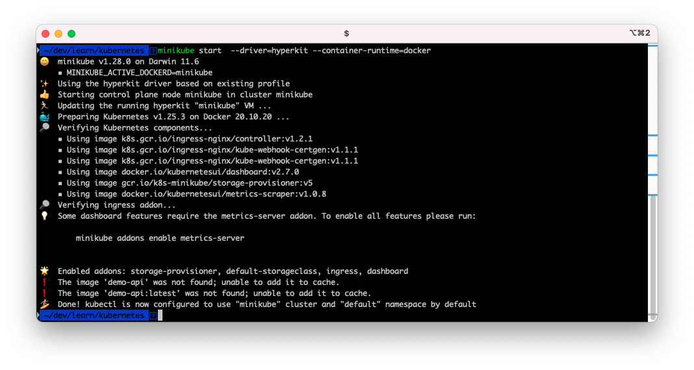
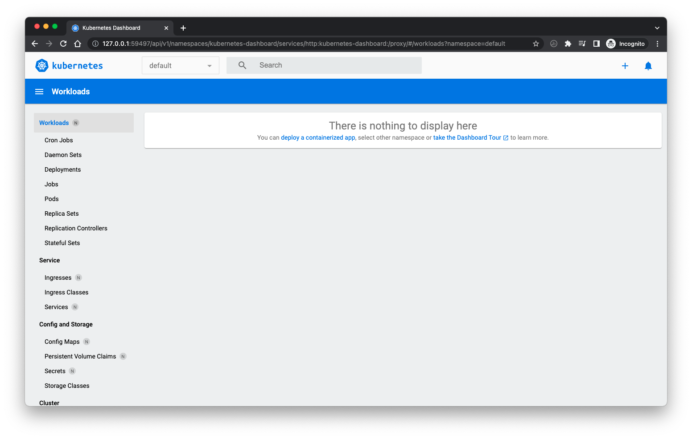

# kubernetes 101 for developers
> This is a tutorial to deploy basic services with kubectl and helm on kubernetes cluster running on local machine.

👉🏼 No cloud account needed.

👉🏼 No Docker desktop needed.


## System Setup


1. install [Docker CLI](https://minikube.sigs.k8s.io/docs/tutorials/docker_desktop_replacement/)

	```shell
	brew install docker
	```

2. install [hyperkit](https://minikube.sigs.k8s.io/docs/drivers/hyperkit/) to be used as docker run time.
	```shell
	brew install hyperkit
	```

3. install [minikube](brew install minikube
) to be used as kubernetes cluster

	```shell
	brew install minikube
	```

4. configure minikube resources (optional)
	
	```shell
	minikube config set cpus 6
	minikube config set memory 12g
	```
	
5. start minikube

	```shell
	minikube start  --driver=hyperkit --container-runtime=docker
	```
    

6. verify minikube

	```shell
	minikube kubectl get nodes
	```
    

7. point terminal's Docker CLI to the Docker instance inside minikube

	```shell
	eval $(minikube docker-env)
	```

8. Optionally you can open minikube dashboard

    ```shell
    minikube dashboard
    ```
    

    It should open a dashboard UI in browser like follow: 
    


## kubectl


### Get ready

1. start minikube
    ```shell
	minikube start  --driver=hyperkit --container-runtime=docker
	```

2. point terminal's Docker CLI to the Docker instance inside minikube

    ```shell
    eval $(minikube docker-env)
    ```

3. build demo app image 

    ```shell
    cd apps/demo-api
    docker build -t demo-api .
    ```
    

### Create a Deployment

1. Create a Deployment that manages a Pod. The Pod runs a Container based on the provided Docker image.

We can not set image pull policy on CLI and we want to use  the local image, so we will create a simple config file to from CLI itself and add the parameter for image pull policy to "Never".
    
    **Create a deployment file.**

    ```shell
    cd ../ # if not on the root path 
    cd kubectl
    ```

    ```shell
    kubectl create deployment demo-api --image=demo-api:latest --dry-run=client -o yaml > deployment.yaml
    ```
    
    
    Modify `spec.template.spec.containers` 
    ```yaml
    spec:
      containers:
      - image: demo-api:latest
        name: demo-api
        resources: {}
    ```
    and add `imagePullPolicy: Never` so that it looks like: 
    ```yaml
    spec:
      containers:
      - image: demo-api:latest
        name: demo-api
        resources: {}
        imagePullPolicy: Never
    ```

    **Apply the config file with kubectl**    
    ```shell
    kubectl apply -f deployment.yaml
    ```
    Output is similar to: 
    ```shell
    kubectl apply -f deployment.yaml
    deployment.apps/demo-api created
    ```

2. View the Deployment:

    ```shell
    kubectl get deployments
    ```

    The output is similar to:

    ```
    NAME       READY   UP-TO-DATE   AVAILABLE   AGE
    demo-api   1/1     1            1           28s
    ```

3. View the Pod:

    ```shell
    kubectl get pods
    ```

    The output is similar to:

    ```shell
    NAME                        READY   STATUS    RESTARTS   AGE
    demo-api-7c7d9f4689-sbkns   1/1     Running   0          100s
    ```

4. View cluster events:

    ```shell
    kubectl get events
    ```

5. View the `kubectl` configuration:

    ```shell
    kubectl config view
    ```


### Create a Service

By default, the Pod is only accessible by its internal IP address within the
Kubernetes cluster. To make the `demo-api` Container accessible from outside.

1. Expose the Pod to the public internet using the `kubectl expose` command:

    ```shell
    kubectl expose deployment demo-api --type=LoadBalancer --port=3000
    ```

2. View the Service you created:

    ```shell
    kubectl get services
    ```

    The output is similar to:

    ```shell
    NAME         TYPE           CLUSTER-IP      EXTERNAL-IP   PORT(S)          AGE
    demo-api     LoadBalancer   10.101.236.39   <pending>     3000:30490/TCP   13s
    kubernetes   ClusterIP      10.96.0.1       <none>        443/TCP          21s
    ```

3. Run the following command to open the app:

    ```shell
    minikube service demo-api
    ```
    The output is similar to:

    ```shell
    |-----------|----------|-------------|----------------------------|
    | NAMESPACE |   NAME   | TARGET PORT |            URL             |
    |-----------|----------|-------------|----------------------------|
    | default   | demo-api |        3000 | http://192.168.106.3:30490 |
    |-----------|----------|-------------|----------------------------|
    🎉  Opening service default/demo-api in default browser...
    ```

    It should open the following page in the browser: 

    


### Clean up

Now you can clean up the resources you created in your cluster:

    ```shell
    kubectl delete service demo-api
    kubectl delete deployment demo-api
    ```

Optionally, stop the Minikube virtual machine (VM):

    ```shell
    minikube stop
    ```

Optionally, delete the Minikube VM:

    ```shell
    minikube delete
    ```

## kustomize

In this we will deploy multiple services. To do so we will be using multiple config files for kubernetes and will manage the config with help of [kustomize](https://github.com/kubernetes-sigs/kustomize). This will deploy a proper backend, frontend and db instance to power up a full application stack and use it as we do in production. This example will use the realworld blog app API and UI example apps. 

We will deploy following services: 
1. blog-api: expressjs backend REST API server. 
2. blog-ui: react UI app being served by a nginx server.
3. postgres: db for blog-api backend service.

### Get ready

1. start minikube
    ```shell
	minikube start  --driver=hyperkit --container-runtime=docker
	```

2. point terminal's Docker CLI to the Docker instance inside minikube

    ```shell
    eval $(minikube docker-env)
    ```

3. build blog-api app image

    ```shell
    cd apps/realblog/blog-api
    docker build -t blog-api .
    ```
    Output will be similar to: 

    ```shell
    ~/dev/learn/kubernetes  cd apps/realblog/blog-api
    docker build -t blog-api .
    Sending build context to Docker daemon  2.048kB
    Step 1/10 : FROM node:16.15.0
    ---> 9d200cd667d5
    Step 2/10 : RUN mkdir -p /home/node/app && chown -R node:node /home/node/app
    ---> Using cache
    ---> 48145b89be5e
    Step 3/10 : WORKDIR /home/node
    ---> Using cache
    ---> 280c540f8d5c
    Step 4/10 : RUN git clone --depth 1 https://github.com/tanem/express-bookshelf-realworld-example-app.git app
    ---> Using cache
    ---> 34dd1b5c6ded
    Step 5/10 : RUN chown -R node:node /home/node/app
    ---> Using cache
    ---> d95cb606a0de
    Step 6/10 : WORKDIR /home/node/app
    ---> Using cache
    ---> 740cacc09bdd
    Step 7/10 : RUN npm i
    ---> Using cache
    ---> 7b86ce450a87
    Step 8/10 : EXPOSE 3000
    ---> Using cache
    ---> 1b4d3ba26c7b
    Step 9/10 : USER node
    ---> Using cache
    ---> 06c0b457b04a
    Step 10/10 : CMD [ "./bin/start.sh" ]
    ---> Using cache
    ---> 487c135295f6
    Successfully built 487c135295f6
    Successfully tagged blog-api:latest
    ``

//////////////////////////////////////////////////////

minikube ip
sudo vi /etc/hosts
k get ingress
k logs realblog-ingress
kubectl get service --all-namespaces | grep ingress\n\n
kubectl get service --all-namespaces \n\n
minikube addons enable ingress
k delete -k ./
k apply -k ./
k get svc
k get ingress
minikube ip
curl http://realblog.local/api/users
k get po
k logs realblog-api-785df47759-4z9bk
code .
k apply -k ./
k logs realblog-api-785df47759-4z9bk
k logs realblog-api-785df47759-4z9bk -f


## helm
